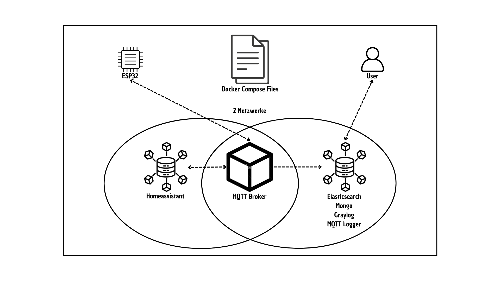
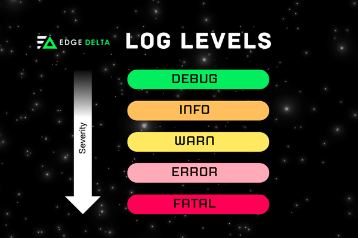

= Table of Contents

== Genereller Aufbau

== Docker Compose File

== HTML Logger

== MQTT Logger

== Graylog
* Inject Logger (Input)
* Logging with Gelf (Log Levels)

== Alternativen zu Graylog

=== ELK Stack (Elasticsearch, Logstash, Kibana)

=== EFK Stack (Elasticsearch, Fluentd, Kibana)

=== Loki (mit Grafana)

== GELF Alternativen (Graylog Extended Log Format)

=== ECS (Elastic Common Schema) format

== Summary

=== Centralized Logging

Logs from various sources are collected in one location, offering unified search and analysis.

Examples:

* ELK Stack
* Splunk
* Graylog

Pros:

* Easier management
* Real-time analytics
* Powerful monitoring

Cons:

* Costly
* Relies on robust network infrastructure

Best For:

* Security monitoring
* Compliance and auditing
* Root cause analysis in large, complex systems

=== Decentralized Logging

Logs are stored locally where events occur, functioning independently of the network.

Examples:

* rsyslog
* Windows Event Log
* Local file storage

Pros:

* Simple setup
* Reliable
* Network-independent

Cons:

* Harder to analyze
* Time-consuming for large systems

Best For:

* Local troubleshooting
* Low-latency or bandwidth-sensitive environments

== Key Considerations

* Scale & Complexity: Centralized logging is better for large-scale systems.
* Network Reliability: Decentralized logging is more resilient to network issues.

== Links

* https://www.howtoforge.de/anleitung/so-installierst-du-elasticsearch-fluentd-und-kibana-efk-logging-stack-auf-ubuntu-22-04/
* https://quarkus.io/guides/centralized-log-management
* https://smallrye.io/smallrye-reactive-messaging/smallrye-reactive-messaging/3.3/mqtt/mqtt.html
* https://stackoverflow.com/questions/38088279/communication-between-multiple-docker-compose-projects
